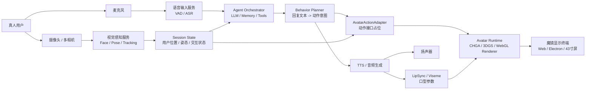

# 智能数字人 Agent 技术方案

> 面向“虚拟试衣智能系统 / 魔镜终端”的实时数字人交互方案。本文根据 `项目说明.md` 中的团队模块整理而来，重点解决：调用项目生成的 3DGS 数字人模型，与真人进行实时语音交互，并通过摄像头跟踪用户驱动数字人转头、注视、表情和动作。

## 1. 目标与边界

### 1.1 目标

构建一个本地优先的智能数字人 Agent，让“魔镜”终端中的数字人具备：

- 语音输入、语音回复和上下文记忆。
- 根据用户话语生成合适的表情、动作、姿态和业务工具调用。
- 通过摄像头持续跟踪真人位置，让数字人做注视、转头、点头等动作。
- 调用团队已有的 CHGA / 3DGS 数字人模型、服装试穿、推荐等模块。
- 支持后续替换数字人渲染接口、动作接口、LLM、ASR、TTS。

### 1.2 当前项目资产

从 `项目说明.md` 可知，现有资产包括：

- `CHGA — Clothed Human Gaussian Avatar 引擎`：基于 Mesh 引导的 3D Gaussian Splatting，可产出可驱动、可换装、可实时渲染的 3D 数字人模型。
- CHGA 输出：可驱动 3DGS 数字人、标准 `.ply` 文件、渲染图像、多层 `AvatarLayer`、SMPL shape 体型参数。
- 魔镜采集与显示模块：43 寸及以上显示终端、多相机联合标定、数字人显示、AI Agent 原型。
- 交互方向：本地化 Agent 编排、Ollama / DeepSeek-R1 / Dify、记忆持久化、状态隔离。
- 约束设备：RTX 30 系列及以上显卡、约 16GB 显存、20GB+ 内存、20GB+ 磁盘为基础配置。

### 1.3 明确假设

- CHGA 训练管线和 3DGS 模型生产由现有团队模块负责，本方案只定义“运行时如何接入和驱动”。
- 数字人动作接口尚未稳定，所以先通过 `AvatarActionAdapter` 抽象层占位。
- 第一版 MVP 只做单用户、单魔镜终端、本地局域网或单机运行。
- 语音交互先以“低延迟可用”为目标，不追求第一版达到完全自然的端到端实时插话。
- 摄像头跟踪先做脸部/人体位置驱动头部朝向，后续再接入全身姿态、手势和情绪识别。

## 2. 推荐总体路线

推荐采用“本地优先 + Web 前端渲染 + Python Agent 服务 + 可替换模型适配器”的路线。

### 2.1 为什么这样选

- 项目已有 Python / PyTorch / CUDA / OpenCV / 多相机标定基础，后端用 Python 接 CHGA、LLM、视觉算法最顺。
- 魔镜显示天然适合 Web / Electron：方便调用摄像头、麦克风、WebGL、全屏展示和远程调试。
- 数字人模型接口尚不稳定，必须把动作、渲染、语音、Agent 编排拆开，避免后续重写整套系统。
- 本地化部署符合项目说明中的低延迟、隐私和“魔镜终端”方向。

### 2.2 三种落地方案对比

| 方案 | 描述 | 优点 | 缺点 | 建议 |
| --- | --- | --- | --- | --- |
| A. 本地 FastAPI + Web 前端 + Ollama | Python 服务负责 Agent、ASR/TTS、动作调度；Web 负责摄像头和渲染 | 与项目技术栈最贴合，隐私好，接口可控 | 本地 LLM 和渲染会抢 GPU | 推荐作为 MVP |
| B. LiveKit / WebRTC 实时音视频 Agent | 用实时音视频平台承载语音、房间、流式事件 | 适合远程多人、低延迟音视频 | 本地魔镜单机第一版偏重 | 第二阶段再评估 |
| C. 云端实时语音大模型 | 用 OpenAI Realtime 等云服务快速做自然语音对话 | 体验好，开发快 | 依赖外网、成本和隐私压力 | 可作为演示备选 |

## 3. 系统架构



### 3.1 核心模块

| 模块 | 职责 | 第一版建议 |
| --- | --- | --- |
| Web Display | 全屏数字人展示、摄像头采集、麦克风采集、WebSocket 通信 | Vite + React + Three.js/WebGL |
| Vision Tracking | 跟踪人脸、人眼、身体框，估计用户相对位置 | MediaPipe Face Landmarker / Pose Landmarker，必要时 OpenCV |
| Audio Input | VAD、录音分片、ASR、打断检测 | Silero VAD + faster-whisper / sherpa-onnx |
| Agent Orchestrator | 多轮对话、工具调用、记忆、业务状态 | LangGraph 或轻量自研状态机，LLM 接 Ollama |
| Behavior Planner | 把 LLM 输出转成可控动作计划 | 规则优先，LLM 只输出高层意图 |
| TTS | 文本转语音，流式播放 | Edge TTS / CosyVoice / Piper，视中文效果选择 |
| LipSync | 从音频或文本生成口型参数 | 第一版用音量驱动，后续接 Audio2Face / 口型模型 |
| Avatar Runtime | 加载 3DGS / CHGA 数字人，执行动作 | 先定义接口，后接团队渲染模块 |
| Memory Store | 用户画像、会话历史、试衣偏好 | SQLite 起步，后续加向量库 |

## 4. 实时链路设计

### 4.1 语音交互链路

```text
麦克风音频
  -> VAD 判断说话起止
  -> ASR 转文字
  -> Agent 加载会话状态和用户画像
  -> LLM 生成结构化结果：回复文本 + 情绪 + 动作意图 + 工具调用
  -> Behavior Planner 校验动作
  -> TTS 生成语音
  -> AvatarActionAdapter 下发 speak / gesture / expression
  -> 前端播放语音并渲染数字人动作
```

第一版建议不要让 LLM 直接控制低层动作参数。LLM 只输出类似 `friendly_greeting`、`thinking`、`recommend_outfit` 这样的高层意图，由 `BehaviorPlanner` 映射成安全动作。

### 4.2 摄像头跟踪链路

```text
摄像头画面
  -> 人脸 / 人体关键点检测
  -> 估计用户中心点、距离、头部朝向
  -> 平滑滤波，去抖动
  -> 生成 look_at / head_turn 动作
  -> AvatarActionAdapter 下发到数字人
```

跟踪动作必须和语音动作分层：

- `look_at` 是高频动作，约 15-30 FPS 更新。
- `gesture` 是低频动作，例如点头、挥手、展示衣服。
- `speech` 和 `lip_sync` 跟随 TTS 音频时间轴。
- 当用户离开画面时，数字人回到 idle 状态。

### 4.3 目标延迟

| 链路 | MVP 目标 | 理想目标 |
| --- | --- | --- |
| 摄像头跟踪到头部动作 | < 150ms | < 80ms |
| 用户说完到开始回答 | < 3s | < 1.5s |
| TTS 首音频输出 | < 1s | < 500ms |
| 数字人渲染 | 30 FPS | 60 FPS |
| 动作命令下发 | < 50ms | < 20ms |

## 5. 技术栈

### 5.1 MVP 推荐栈

| 层级 | 技术 | 说明 |
| --- | --- | --- |
| 前端 | Vite + React + TypeScript | 快速开发魔镜 UI |
| 3D 渲染 | Three.js / WebGL / 3DGS Viewer | 先加载 `.ply` 或渲染流，后续接 CHGA runtime |
| 摄像头感知 | MediaPipe Face Landmarker / Pose Landmarker | 浏览器端低延迟跟踪 |
| 后端 API | FastAPI + WebSocket | 统一传输音频、文本、状态、动作事件 |
| Agent 编排 | LangGraph 或自研状态机 | 管理对话、工具、记忆和业务状态 |
| 本地 LLM | Ollama + Qwen / DeepSeek 系列 | 优先选支持工具调用和中文效果好的模型 |
| ASR | faster-whisper / sherpa-onnx | 本地中文语音识别 |
| VAD | Silero VAD / WebRTC VAD | 说话起止和打断检测 |
| TTS | CosyVoice / Edge TTS / Piper | 中文自然度优先 |
| 存储 | SQLite + 文件目录 | 会话、用户画像、模型元数据 |
| 部署 | Windows + Python venv / WSL2 / Docker | 先单机，再容器化 |

### 5.2 可选增强

| 能力 | 可选技术 | 何时需要 |
| --- | --- | --- |
| 超低延迟全双工语音 | OpenAI Realtime API / LiveKit Agents | 需要快速演示云端自然语音 |
| 专业口型与表情 | NVIDIA Audio2Face / 自研 viseme 模型 | 需要更逼真的口型、面部动画 |
| 多终端远程音视频 | LiveKit / WebRTC | 需要多个魔镜或远程控制端 |
| 复杂业务编排 | Dify / LangGraph | 需要推荐、试穿、用户画像、导购流程 |
| 高性能渲染 | 原生 Unity / Unreal / CUDA renderer | WebGL 无法满足 3DGS 驱动性能时 |

## 6. 数字人动作接口设计

### 6.1 动作接口原则

- Agent 不直接操作模型内部参数。
- 所有动作通过 `AvatarActionAdapter` 发送。
- 动作要有优先级，避免“转头”和“点头”互相打架。
- 实时跟踪类动作可以被高频覆盖；语音和手势类动作按时间轴执行。
- 模型暂时没有实现的动作可以先记录日志，不阻塞语音交互。

### 6.2 动作类型

| 动作 | 示例 | 用途 |
| --- | --- | --- |
| `look_at` | 看向用户脸部方向 | 摄像头跟踪 |
| `head_pose` | 设置 yaw / pitch / roll | 转头、低头、抬头 |
| `gesture` | nod / wave / point_to_clothes | 点头、挥手、导购动作 |
| `expression` | smile / thinking / surprised | 表情 |
| `speech_start` | 开始说话 | 驱动口型和说话状态 |
| `speech_end` | 结束说话 | 回到 idle |
| `lip_sync` | viseme 时间序列 | 口型 |
| `pose` | HMR / SMPL 参数 | 全身姿态驱动 |
| `load_avatar` | avatar_id / model_path | 加载模型 |
| `try_on` | garment_id / layer_id | 换装 |

### 6.3 统一动作消息

```json
{
  "event": "avatar.action",
  "session_id": "mirror-001",
  "action_id": "act-20260510-0001",
  "type": "look_at",
  "priority": "realtime",
  "timestamp_ms": 1778400000000,
  "duration_ms": 120,
  "payload": {
    "target": "user_face",
    "yaw": 8.5,
    "pitch": -3.0,
    "roll": 0.0,
    "confidence": 0.91
  }
}
```

### 6.4 Avatar Runtime API 占位

数字人模型动作接口可以先按下面的 HTTP / WebSocket 协议预留，等 CHGA runtime 稳定后替换实现。

```http
POST /avatar/load
Content-Type: application/json

{
  "avatar_id": "demo_chga_001",
  "model_path": "models/demo_chga_001/model.ply",
  "metadata_path": "models/demo_chga_001/avatar.json"
}
```

```http
POST /avatar/action
Content-Type: application/json

{
  "type": "gesture",
  "name": "nod",
  "intensity": 0.6,
  "duration_ms": 800
}
```

```http
POST /avatar/pose
Content-Type: application/json

{
  "format": "smpl",
  "body_pose": [],
  "global_orient": [],
  "transl": [0, 0, 0],
  "betas": []
}
```

```text
WS /avatar/events
  <- avatar.ready
  <- avatar.frame_stats
  <- avatar.action_done
  <- avatar.error
```

## 7. Agent 输出协议

### 7.1 LLM 结构化输出

让 LLM 输出结构化 JSON，禁止直接输出任意代码或底层动作参数。

```json
{
  "reply_text": "我看到你今天选择的是浅色外套，我可以帮你搭一条更显腿长的裤子。",
  "emotion": "friendly",
  "intent": "outfit_advice",
  "actions": [
    {
      "type": "gesture",
      "name": "nod",
      "intensity": 0.4
    },
    {
      "type": "expression",
      "name": "smile",
      "intensity": 0.6
    }
  ],
  "tool_calls": [
    {
      "name": "recommend_outfits",
      "arguments": {
        "style": "commute",
        "color_preference": "light"
      }
    }
  ],
  "memory_updates": {
    "style_preference": "commute",
    "likes_light_colors": true
  }
}
```

### 7.2 工具接口

第一版建议只开放少量稳定工具。

```python
from typing import Protocol, TypedDict


class OutfitRecommendation(TypedDict):
    garment_id: str
    name: str
    reason: str
    preview_url: str | None


class AgentTools(Protocol):
    async def recommend_outfits(
        self,
        user_id: str,
        style: str | None,
        color_preference: str | None,
    ) -> list[OutfitRecommendation]:
        ...

    async def try_on(
        self,
        avatar_id: str,
        garment_id: str,
    ) -> dict:
        ...

    async def load_avatar(
        self,
        user_id: str,
    ) -> dict:
        ...
```

## 8. 推荐代码框架

当前工作区几乎为空，建议从下面的结构开始。先不要把所有模块写复杂，第一版只实现 `agent-api` 和 `web` 两块。

```text
dagital_human_agent/
  README.md
  智能数字人Agent技术方案.md
  pyproject.toml
  .env.example

  apps/
    web/
      package.json
      src/
        main.tsx
        App.tsx
        api/wsClient.ts
        avatar/AvatarScene.tsx
        avatar/avatarActions.ts
        vision/useFaceTracking.ts
        audio/useMicrophone.ts
        state/sessionStore.ts

  services/
    agent-api/
      app/
        main.py
        config.py
        schemas.py
        session_store.py
        agent/
          orchestrator.py
          prompts.py
          behavior_planner.py
          tools.py
          memory.py
        adapters/
          avatar_action.py
          asr.py
          tts.py
          vad.py
          llm.py
        vision/
          tracking_state.py
        runtime/
          event_bus.py
      tests/
        test_behavior_planner.py
        test_avatar_action_adapter.py

  models/
    avatars/
      demo_chga_001/
        avatar.json
        model.ply

  configs/
    local.yaml
    avatar_actions.yaml

  docs/
    api/
      avatar_action_protocol.md
```

## 9. 后端关键代码骨架

### 9.1 WebSocket 服务入口

```python
# services/agent-api/app/main.py
from fastapi import FastAPI, WebSocket, WebSocketDisconnect

from app.agent.orchestrator import AgentOrchestrator
from app.runtime.event_bus import SessionEventBus
from app.schemas import ClientEvent

app = FastAPI(title="Digital Human Agent API")

event_bus = SessionEventBus()
agent = AgentOrchestrator(event_bus=event_bus)


@app.websocket("/ws/session/{session_id}")
async def session_ws(websocket: WebSocket, session_id: str) -> None:
    await websocket.accept()
    await event_bus.attach(session_id, websocket)

    try:
        while True:
            payload = await websocket.receive_json()
            event = ClientEvent.model_validate(payload)
            await agent.handle_event(session_id=session_id, event=event)
    except WebSocketDisconnect:
        await event_bus.detach(session_id, websocket)
```

### 9.2 事件 Schema

```python
# services/agent-api/app/schemas.py
from typing import Any, Literal
from pydantic import BaseModel, Field


class ClientEvent(BaseModel):
    event: str
    payload: dict[str, Any] = Field(default_factory=dict)


class VisionState(BaseModel):
    user_visible: bool
    face_center_x: float | None = None
    face_center_y: float | None = None
    yaw: float | None = None
    pitch: float | None = None
    distance_m: float | None = None
    confidence: float = 0.0


class AvatarAction(BaseModel):
    type: Literal[
        "look_at",
        "head_pose",
        "gesture",
        "expression",
        "speech_start",
        "speech_end",
        "lip_sync",
        "pose",
        "try_on",
    ]
    priority: Literal["realtime", "normal", "blocking"] = "normal"
    duration_ms: int | None = None
    payload: dict[str, Any] = Field(default_factory=dict)
```

### 9.3 数字人动作适配器

```python
# services/agent-api/app/adapters/avatar_action.py
from abc import ABC, abstractmethod
from app.schemas import AvatarAction


class AvatarActionAdapter(ABC):
    @abstractmethod
    async def send(self, session_id: str, action: AvatarAction) -> None:
        """Send an avatar action to the current avatar runtime."""


class NullAvatarActionAdapter(AvatarActionAdapter):
    async def send(self, session_id: str, action: AvatarAction) -> None:
        print(f"[avatar:{session_id}] {action.model_dump_json()}")


class HttpAvatarActionAdapter(AvatarActionAdapter):
    def __init__(self, base_url: str) -> None:
        self.base_url = base_url

    async def send(self, session_id: str, action: AvatarAction) -> None:
        # When the CHGA runtime API is ready, replace this with httpx POST.
        print(f"[avatar-http:{session_id}] -> {self.base_url} {action.model_dump()}")
```

### 9.4 行为规划器

```python
# services/agent-api/app/agent/behavior_planner.py
from app.schemas import AvatarAction, VisionState


class BehaviorPlanner:
    def from_vision(self, vision: VisionState) -> list[AvatarAction]:
        if not vision.user_visible or vision.confidence < 0.5:
            return [
                AvatarAction(
                    type="gesture",
                    priority="normal",
                    payload={"name": "idle_scan", "intensity": 0.2},
                )
            ]

        return [
            AvatarAction(
                type="look_at",
                priority="realtime",
                duration_ms=120,
                payload={
                    "target": "user_face",
                    "yaw": vision.yaw or 0.0,
                    "pitch": vision.pitch or 0.0,
                    "confidence": vision.confidence,
                },
            )
        ]

    def from_agent_reply(self, reply: dict) -> list[AvatarAction]:
        emotion = reply.get("emotion", "neutral")
        actions = [
            AvatarAction(
                type="expression",
                priority="normal",
                duration_ms=1200,
                payload={"name": emotion, "intensity": 0.6},
            )
        ]

        for action in reply.get("actions", []):
            if action.get("type") == "gesture":
                actions.append(
                    AvatarAction(
                        type="gesture",
                        priority="normal",
                        duration_ms=action.get("duration_ms", 800),
                        payload={
                            "name": action.get("name", "nod"),
                            "intensity": action.get("intensity", 0.5),
                        },
                    )
                )

        return actions
```

### 9.5 Agent 编排器

```python
# services/agent-api/app/agent/orchestrator.py
from app.adapters.avatar_action import NullAvatarActionAdapter
from app.agent.behavior_planner import BehaviorPlanner
from app.schemas import ClientEvent, VisionState


class AgentOrchestrator:
    def __init__(self, event_bus) -> None:
        self.event_bus = event_bus
        self.behavior = BehaviorPlanner()
        self.avatar = NullAvatarActionAdapter()

    async def handle_event(self, session_id: str, event: ClientEvent) -> None:
        if event.event == "vision.state":
            vision = VisionState.model_validate(event.payload)
            for action in self.behavior.from_vision(vision):
                await self.avatar.send(session_id, action)
                await self.event_bus.publish(session_id, "avatar.action", action.model_dump())
            return

        if event.event == "audio.transcript.final":
            user_text = event.payload["text"]
            reply = await self._reply(session_id, user_text)

            await self.event_bus.publish(session_id, "agent.reply", reply)
            for action in self.behavior.from_agent_reply(reply):
                await self.avatar.send(session_id, action)
                await self.event_bus.publish(session_id, "avatar.action", action.model_dump())

    async def _reply(self, session_id: str, user_text: str) -> dict:
        # Replace with Ollama / LangGraph call.
        return {
            "reply_text": f"我听到了：{user_text}",
            "emotion": "friendly",
            "actions": [{"type": "gesture", "name": "nod", "intensity": 0.4}],
            "tool_calls": [],
        }
```

## 10. 前端关键代码骨架

### 10.1 WebSocket 客户端

```ts
// apps/web/src/api/wsClient.ts
export type ClientEvent = {
  event: string;
  payload: Record<string, unknown>;
};

export function createSessionSocket(sessionId: string) {
  const ws = new WebSocket(`ws://localhost:8000/ws/session/${sessionId}`);

  return {
    send(event: ClientEvent) {
      if (ws.readyState === WebSocket.OPEN) {
        ws.send(JSON.stringify(event));
      }
    },
    onMessage(handler: (event: ClientEvent) => void) {
      ws.onmessage = (message) => handler(JSON.parse(message.data));
    },
  };
}
```

### 10.2 摄像头跟踪 Hook

```ts
// apps/web/src/vision/useFaceTracking.ts
import { useEffect } from "react";
import type { ClientEvent } from "../api/wsClient";

type SendEvent = (event: ClientEvent) => void;

export function useFaceTracking(video: HTMLVideoElement | null, send: SendEvent) {
  useEffect(() => {
    if (!video) return;

    let stopped = false;

    async function loop() {
      while (!stopped) {
        // Replace with MediaPipe Face Landmarker result.
        const visionState = {
          user_visible: true,
          face_center_x: 0.5,
          face_center_y: 0.42,
          yaw: 0,
          pitch: -2,
          distance_m: 1.2,
          confidence: 0.8,
        };

        send({ event: "vision.state", payload: visionState });
        await new Promise((resolve) => setTimeout(resolve, 66));
      }
    }

    loop();
    return () => {
      stopped = true;
    };
  }, [video, send]);
}
```

### 10.3 数字人动作执行器

```ts
// apps/web/src/avatar/avatarActions.ts
export type AvatarAction = {
  type: string;
  priority: "realtime" | "normal" | "blocking";
  duration_ms?: number;
  payload: Record<string, unknown>;
};

export class BrowserAvatarRuntime {
  load(modelPath: string) {
    // Load 3DGS .ply / WebGL scene here.
    console.log("load avatar", modelPath);
  }

  apply(action: AvatarAction) {
    if (action.type === "look_at") {
      this.lookAt(action.payload);
    }
    if (action.type === "gesture") {
      this.playGesture(action.payload);
    }
    if (action.type === "expression") {
      this.setExpression(action.payload);
    }
  }

  private lookAt(payload: Record<string, unknown>) {
    console.log("look_at", payload);
  }

  private playGesture(payload: Record<string, unknown>) {
    console.log("gesture", payload);
  }

  private setExpression(payload: Record<string, unknown>) {
    console.log("expression", payload);
  }
}
```

## 11. MVP 实施计划

### 阶段 0：接口对齐，1-2 天

交付：

- 确认 CHGA 当前能提供哪种运行形态：`.ply` 静态查看、实时渲染服务、还是可驱动 runtime。
- 确认模型动作最小接口：`look_at`、`gesture`、`expression`、`pose` 哪些能做。
- 固化 `AvatarAction` JSON 协议。

验收：

- 后端发送一条 `look_at` 动作，前端或日志能收到。
- 没有真实模型时，`NullAvatarActionAdapter` 可以记录完整动作。

### 阶段 1：语音 + Agent 闭环，3-5 天

交付：

- FastAPI WebSocket 服务。
- 浏览器录音或本地麦克风采集。
- VAD + ASR 得到用户文本。
- LLM 生成回复文本和动作意图。
- TTS 播放回复语音。

验收：

- 用户说一句中文，系统能在 3 秒内开始回答。
- 回复事件包含 `reply_text`、`emotion`、`actions`。
- 数字人动作接口能收到 `speech_start`、`expression`、`gesture`。

### 阶段 2：摄像头跟踪 + 头部注视，3-5 天

交付：

- 前端摄像头采集。
- MediaPipe 人脸关键点 / 姿态估计。
- `VisionState` 通过 WebSocket 发送到后端。
- `BehaviorPlanner` 生成 `look_at` 动作。

验收：

- 用户左右移动时，动作接口持续收到 yaw 变化。
- 用户离开画面后，数字人回到 idle。
- 高频动作不会打断语音回复。

### 阶段 3：接入 3DGS / CHGA 展示，5-10 天

交付：

- 加载团队产出的 `.ply` 或 CHGA runtime 输出。
- WebGL 或独立渲染服务显示数字人。
- 将 `look_at`、`gesture`、`expression` 映射到真实模型能力。
- 如暂不支持骨骼动作，先用相机角度、模型整体旋转、预设动画近似。

验收：

- 魔镜屏幕可展示团队数字人资产。
- 摄像头跟踪能反映到数字人头部或视线方向。
- 语音回复时有说话状态和基础口型/表情变化。

### 阶段 4：业务工具与试衣推荐，5-10 天

交付：

- 接入用户画像、体型参数、服装推荐。
- 接入 `try_on` 工具，调用 AvatarLayer 或试穿模块。
- Agent 可以解释推荐理由，并触发换装动作。

验收：

- 用户说“帮我换一套通勤风”，Agent 能调用推荐工具。
- 推荐结果能触发数字人换装或展示候选服装。
- 记忆中保留用户偏好。

## 12. 部署建议

### 12.1 单机魔镜终端

```text
Windows 主机
  - Chrome / Electron 全屏显示
  - Python FastAPI agent-api
  - Ollama 本地 LLM
  - ASR / TTS 本地服务
  - 摄像头 / 麦克风 / 扬声器
  - WebGL 或本地 CHGA runtime
```

适合第一版 Demo，部署简单，调试快。

### 12.2 双机部署

```text
魔镜终端
  - 前端展示
  - 摄像头和麦克风
  - 轻量动作渲染

GPU 工作站 / 服务器
  - LLM
  - ASR / TTS
  - CHGA runtime
  - 推荐和试穿模块
```

适合本地显存不足或 CHGA runtime 较重的情况。

### 12.3 GPU 资源建议

- 16GB 显存：可运行量化 7B/14B LLM + 基础渲染，但要注意显存竞争。
- 24GB+ 显存：更适合本地 LLM、ASR/TTS 和 3DGS runtime 同机运行。
- 训练 CHGA 仍建议使用已有 RTX 5090 / 高性能服务器，不放在魔镜终端。

## 13. 风险与处理

| 风险 | 表现 | 处理 |
| --- | --- | --- |
| CHGA runtime 暂不支持动作 | 只能加载 `.ply` 静态模型 | 先实现动作日志和整体模型旋转，保留接口 |
| 本地 LLM 抢占 GPU | 渲染掉帧、回复慢 | LLM 用 CPU/低显存量化，或双机部署 |
| 语音回声 | 数字人说话被 ASR 再识别 | TTS 播放时暂停 ASR 或加回声消除 |
| 摄像头光照不稳定 | 跟踪抖动、丢脸 | 固定魔镜灯光，使用平滑滤波和置信度阈值 |
| LLM 动作乱输出 | 动作不合时宜 | 结构化输出 + BehaviorPlanner 白名单 |
| 口型不真实 | 只张嘴不对音素 | MVP 用音量驱动，演示后接 viseme / Audio2Face |
| 多模块接口不齐 | 推荐、试穿、动作互相等 | 先用 mock 工具，接口稳定后替换实现 |

## 14. 第一版验收标准

MVP 完成时至少满足：

- 打开魔镜页面后能看到数字人或数字人占位场景。
- 摄像头识别到真人后，持续发送 `vision.state`。
- 用户移动时，系统生成 `look_at` 或 `head_pose` 动作。
- 用户语音提问后，Agent 能生成中文语音回复。
- 回复过程中数字人进入 `speech_start` 状态，结束后进入 `speech_end`。
- 所有动作都经过 `AvatarActionAdapter`，后续可无痛替换为真实 CHGA 接口。
- 用户偏好至少能写入 SQLite，并在下一轮对话中读取。

## 15. 推荐下一步

1. 和 CHGA 模块负责人确认可用 runtime 形态：静态 `.ply`、实时渲染 API、还是可驱动模型接口。
2. 先实现 `agent-api` 的 WebSocket 和 `NullAvatarActionAdapter`，让交互链路跑通。
3. 前端先用简单 3D 场景或静态 `.ply` 做展示，不等最终数字人动作模型。
4. 摄像头跟踪先只做 `look_at`，不急着做复杂全身动作。
5. 语音链路先做“说完再答”，跑通后再做流式 ASR、流式 TTS 和打断。

## 16. 官方资料参考

- [FastAPI WebSockets](https://fastapi.tiangolo.com/advanced/websockets/)
- [MediaPipe Face Landmarker for Web](https://ai.google.dev/edge/mediapipe/solutions/vision/face_landmarker/web_js)
- [MediaPipe Pose Landmarker](https://ai.google.dev/edge/mediapipe/solutions/vision/pose_landmarker)
- [LangGraph Documentation](https://docs.langchain.com/oss/python/langgraph/overview)
- [LiveKit Agents](https://docs.livekit.io/agents/)
- [OpenAI Realtime API](https://platform.openai.com/docs/guides/realtime)
- [NVIDIA Audio2Face 3D Microservice](https://docs.nvidia.com/ace/audio2face-3d-microservice/latest/)
- [Three.js WebGLRenderer](https://threejs.org/docs/#api/en/renderers/WebGLRenderer)
